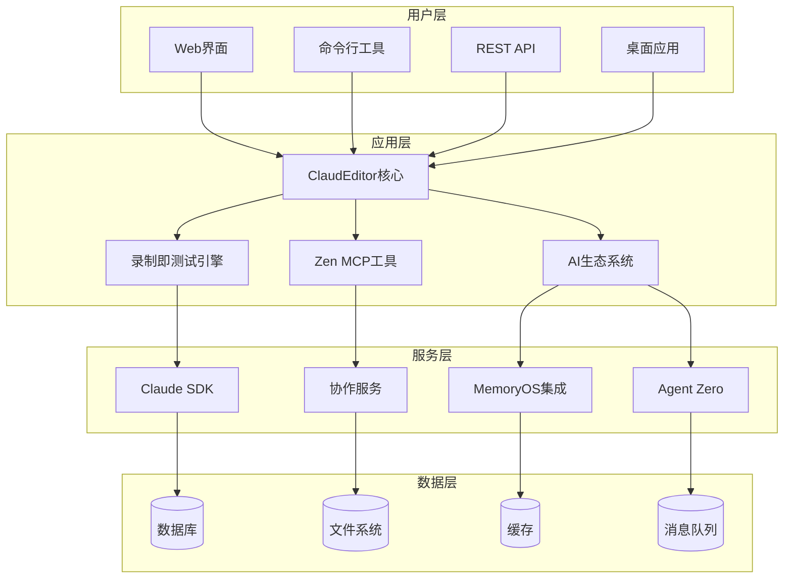
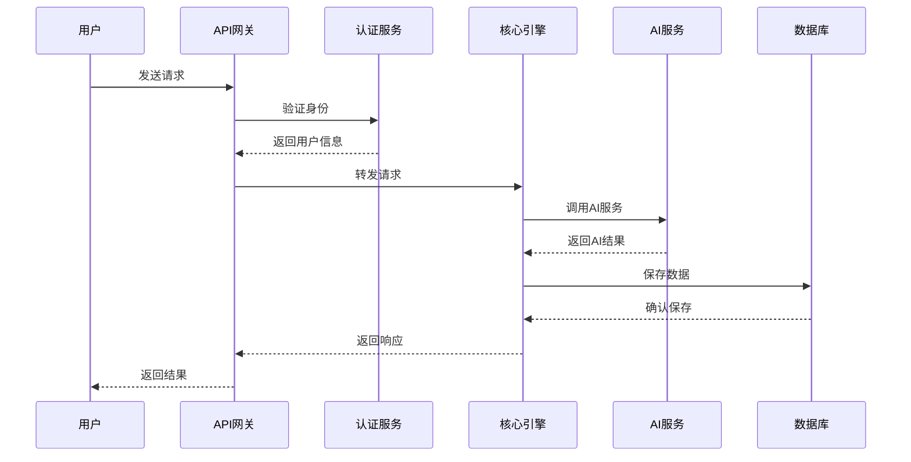
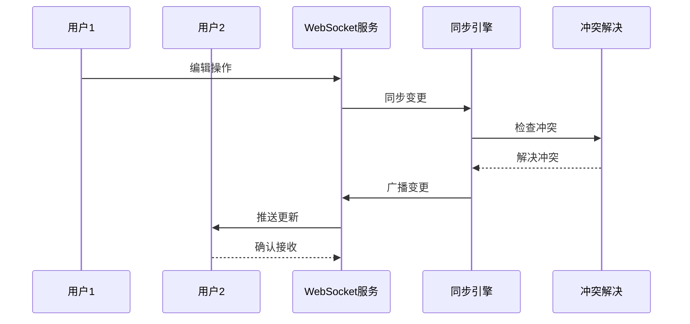

# 🏗️ PowerAutomation v4.1 架构设计

PowerAutomation v4.1采用模块化、可扩展的企业级架构设计，支持大规模部署和高并发访问。

## 📊 整体架构



## 🎯 核心组件

### 1. ClaudEditor核心引擎
```python
class ClaudEditorCore:
    """ClaudEditor核心引擎"""
    
    def __init__(self):
        self.ai_coordinator = AICoordinator()
        self.record_engine = RecordAsTestEngine()
        self.mcp_manager = ZenMCPManager()
        self.collaboration = CollaborationEngine()
    
    async def process_request(self, request):
        """处理用户请求"""
        # 智能路由到相应的处理器
        return await self.ai_coordinator.route(request)
```

### 2. 录制即测试引擎
```python
class RecordAsTestEngine:
    """录制即测试核心引擎"""
    
    def __init__(self):
        self.action_recognizer = ActionRecognitionEngine()
        self.test_generator = TestNodeGenerator()
        self.playback_engine = PlaybackVerificationEngine()
    
    async def start_recording(self):
        """开始录制用户操作"""
        return await self.action_recognizer.start()
    
    async def generate_test(self, recording):
        """生成测试用例"""
        return await self.test_generator.create_test_nodes(recording)
```

### 3. AI生态系统集成
```python
class AIEcosystemIntegration:
    """AI生态系统集成管理器"""
    
    def __init__(self):
        self.claude_sdk = ClaudeSDK()
        self.memory_os = MemoryOSIntegration()
        self.agent_zero = AgentZeroIntegration()
        self.model_coordinator = MultiModelCoordinator()
    
    async def intelligent_routing(self, task):
        """智能任务路由"""
        best_model = await self.model_coordinator.select_model(task)
        return await best_model.process(task)
```

## 🔧 技术栈

### 后端技术
- **Python 3.11**: 主要编程语言
- **FastAPI**: 高性能Web框架
- **SQLAlchemy**: ORM数据库操作
- **Redis**: 缓存和会话管理
- **Celery**: 异步任务队列
- **WebSocket**: 实时通信

### 前端技术
- **React 18**: 用户界面框架
- **TypeScript**: 类型安全的JavaScript
- **Material-UI**: UI组件库
- **Socket.io**: 实时通信客户端
- **Monaco Editor**: 代码编辑器

### AI和机器学习
- **Claude API**: 主要AI模型
- **Transformers**: 本地模型支持
- **OpenCV**: 图像处理
- **Selenium**: 浏览器自动化
- **TensorFlow**: 机器学习框架

### 基础设施
- **Docker**: 容器化部署
- **Kubernetes**: 容器编排
- **Nginx**: 反向代理
- **PostgreSQL**: 主数据库
- **MongoDB**: 文档数据库

## 📈 性能架构

### 1. 分布式架构
```yaml
# 分布式部署配置
services:
  web:
    replicas: 3
    resources:
      cpu: "1"
      memory: "2Gi"
  
  api:
    replicas: 5
    resources:
      cpu: "2"
      memory: "4Gi"
  
  worker:
    replicas: 10
    resources:
      cpu: "1"
      memory: "1Gi"
```

### 2. 缓存策略
```python
class CacheStrategy:
    """缓存策略管理"""
    
    def __init__(self):
        self.redis_client = Redis()
        self.memory_cache = LRUCache(maxsize=1000)
    
    async def get_cached_result(self, key):
        """获取缓存结果"""
        # L1: 内存缓存
        if key in self.memory_cache:
            return self.memory_cache[key]
        
        # L2: Redis缓存
        result = await self.redis_client.get(key)
        if result:
            self.memory_cache[key] = result
            return result
        
        return None
```

### 3. 负载均衡
```nginx
# Nginx负载均衡配置
upstream powerautomation_backend {
    least_conn;
    server api1:8000 weight=3;
    server api2:8000 weight=3;
    server api3:8000 weight=2;
    server api4:8000 weight=2;
}

server {
    listen 80;
    server_name powerautomation.com;
    
    location /api/ {
        proxy_pass http://powerautomation_backend;
        proxy_set_header Host $host;
        proxy_set_header X-Real-IP $remote_addr;
    }
}
```

## 🔒 安全架构

### 1. 身份验证和授权
```python
class SecurityManager:
    """安全管理器"""
    
    def __init__(self):
        self.jwt_manager = JWTManager()
        self.rbac = RoleBasedAccessControl()
        self.audit_logger = AuditLogger()
    
    async def authenticate(self, credentials):
        """用户身份验证"""
        user = await self.verify_credentials(credentials)
        if user:
            token = self.jwt_manager.create_token(user)
            await self.audit_logger.log_login(user)
            return token
        return None
    
    async def authorize(self, user, resource, action):
        """权限授权检查"""
        return await self.rbac.check_permission(user, resource, action)
```

### 2. 数据加密
```python
class EncryptionService:
    """数据加密服务"""
    
    def __init__(self):
        self.fernet = Fernet(settings.ENCRYPTION_KEY)
    
    def encrypt_sensitive_data(self, data):
        """加密敏感数据"""
        return self.fernet.encrypt(data.encode())
    
    def decrypt_sensitive_data(self, encrypted_data):
        """解密敏感数据"""
        return self.fernet.decrypt(encrypted_data).decode()
```

### 3. API安全
```python
class APISecurityMiddleware:
    """API安全中间件"""
    
    async def __call__(self, request, call_next):
        # 速率限制
        if not await self.check_rate_limit(request):
            raise HTTPException(429, "Rate limit exceeded")
        
        # 输入验证
        await self.validate_input(request)
        
        # 执行请求
        response = await call_next(request)
        
        # 输出过滤
        return await self.filter_output(response)
```

## 🔄 数据流架构

### 1. 请求处理流程


### 2. 实时协作流程


## 📊 监控和观测

### 1. 性能监控
```python
class PerformanceMonitor:
    """性能监控器"""
    
    def __init__(self):
        self.metrics_collector = MetricsCollector()
        self.alerting = AlertingService()
    
    async def track_request(self, request):
        """跟踪请求性能"""
        start_time = time.time()
        
        try:
            result = await self.process_request(request)
            duration = time.time() - start_time
            
            await self.metrics_collector.record_metric(
                "request_duration", duration,
                tags={"endpoint": request.url.path}
            )
            
            return result
        except Exception as e:
            await self.alerting.send_alert(f"Request failed: {e}")
            raise
```

### 2. 健康检查
```python
class HealthChecker:
    """健康检查服务"""
    
    async def check_health(self):
        """检查系统健康状态"""
        checks = {
            "database": await self.check_database(),
            "redis": await self.check_redis(),
            "claude_api": await self.check_claude_api(),
            "disk_space": await self.check_disk_space(),
            "memory_usage": await self.check_memory_usage()
        }
        
        overall_status = "healthy" if all(checks.values()) else "unhealthy"
        
        return {
            "status": overall_status,
            "checks": checks,
            "timestamp": datetime.utcnow().isoformat()
        }
```

## 🚀 部署架构

### 1. 容器化部署
```dockerfile
# Dockerfile
FROM python:3.11-slim

WORKDIR /app

COPY requirements.txt .
RUN pip install --no-cache-dir -r requirements.txt

COPY . .

EXPOSE 8000

CMD ["uvicorn", "main:app", "--host", "0.0.0.0", "--port", "8000"]
```

### 2. Kubernetes部署
```yaml
# deployment.yaml
apiVersion: apps/v1
kind: Deployment
metadata:
  name: powerautomation-api
spec:
  replicas: 3
  selector:
    matchLabels:
      app: powerautomation-api
  template:
    metadata:
      labels:
        app: powerautomation-api
    spec:
      containers:
      - name: api
        image: powerautomation/api:v4.1.0
        ports:
        - containerPort: 8000
        env:
        - name: DATABASE_URL
          valueFrom:
            secretKeyRef:
              name: db-secret
              key: url
        resources:
          requests:
            memory: "1Gi"
            cpu: "500m"
          limits:
            memory: "2Gi"
            cpu: "1"
```

## 📈 扩展性设计

### 1. 水平扩展
- **无状态设计**: 所有服务都是无状态的，支持水平扩展
- **数据库分片**: 支持数据库水平分片
- **缓存集群**: Redis集群支持
- **消息队列**: 分布式消息队列

### 2. 垂直扩展
- **资源动态调整**: 根据负载动态调整资源
- **GPU加速**: 支持GPU加速AI计算
- **内存优化**: 智能内存管理和垃圾回收

### 3. 插件架构
```python
class PluginManager:
    """插件管理器"""
    
    def __init__(self):
        self.plugins = {}
        self.hooks = defaultdict(list)
    
    def register_plugin(self, plugin):
        """注册插件"""
        self.plugins[plugin.name] = plugin
        for hook_name in plugin.hooks:
            self.hooks[hook_name].append(plugin)
    
    async def execute_hook(self, hook_name, *args, **kwargs):
        """执行钩子"""
        results = []
        for plugin in self.hooks[hook_name]:
            result = await plugin.execute_hook(hook_name, *args, **kwargs)
            results.append(result)
        return results
```

## 🔮 未来架构演进

### 短期目标 (3-6个月)
- **微服务拆分**: 将单体应用拆分为微服务
- **服务网格**: 引入Istio服务网格
- **边缘计算**: 支持边缘节点部署

### 中期目标 (6-12个月)
- **多云部署**: 支持多云环境部署
- **AI模型优化**: 本地模型部署和优化
- **实时流处理**: 引入流处理架构

### 长期目标 (1-2年)
- **量子计算**: 探索量子计算集成
- **区块链**: 去中心化功能支持
- **元宇宙**: 虚拟现实环境集成

---

**🏗️ PowerAutomation v4.1 - 企业级架构，面向未来**

*可扩展、高性能、安全可靠的AI自动化平台架构*

